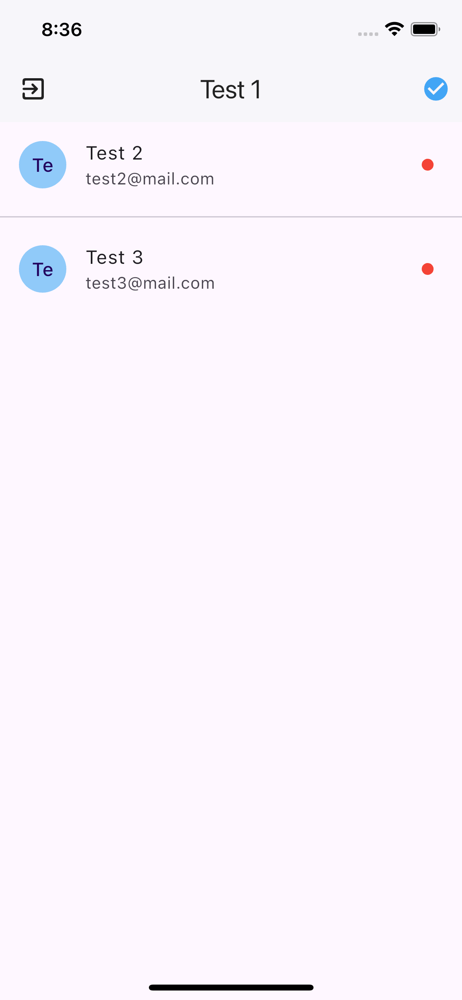

# Flutter Chat RealTime

Android, iOS
<br/>
Chat project implementing web socket in flutter.
The data storage used is MongoDB served by a simple API in JS

### Chat RealTime backend project:
```
npm run start:dev
```
* [ Server Chat Realtime  ](https://github.com/Yader1/server-chat-realtime)

### View
 | |
-----------------------------------|------------------------------------|

 | |
-----------------------------------|------------------------------------|